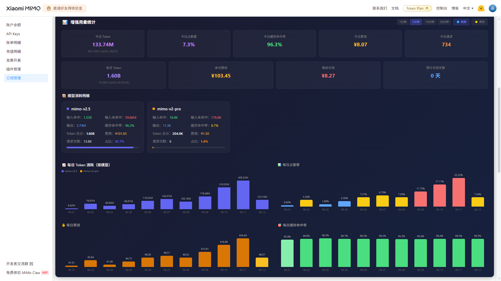

# MiMo 增强用量统计

在 [Xiaomi MiMo 开放平台](https://platform.xiaomimimo.com/console/plan-manage) 用量统计页面注入增强统计面板，让用量一目了然。

## 功能一览

- **核心指标卡片**（暗色/亮色双主题）
  - 今日 Token 消耗（含 Credits 换算和费用）
  - 今日占套餐百分比
  - 今日缓存命中率
  - 今日费用（¥）
  - 本月 Token 消耗、本月费用、剩余可用额度、预计可用天数
- **模型消耗明细**
  - 按使用量排序，未使用的模型自动隐藏
  - 显示：输入命中、未命中、输出、缓存命中率、请求次数、费用、占比
- **柱状图**（支持横向滚动，适配 30 天数据）
  - 每日 Token 消耗（按模型堆叠，不同颜色）
  - 每日占套餐百分比
  - 每日费用（¥）
  - 每日缓存命中率
- **换肤**：暗色 / 亮色切换
- **刷新控制**：默认 5 分钟自动刷新，可选 1/5/10/30 分钟，支持手动刷新

## 安装（小白教程）

### 第 1 步：安装 Tampermonkey

打开浏览器，点击下面的链接安装 Tampermonkey 扩展：

- **Chrome**：[Chrome 商店](https://chrome.google.com/webstore/detail/tampermonkey/dhdgffkkebhmkfjojejmpbldmpobfkfo)
- **Edge**：[Edge 商店](https://microsoftedge.microsoft.com/addons/detail/tampermonkey/iikmkjmpakdobipldfnkgcahniibfjgn)
- **Firefox**：[Firefox 商店](https://addons.mozilla.org/firefox/addon/tampermonkey/)

安装后浏览器右上角会出现 Tampermonkey 图标（黑色方块里的白色方块）。

### 第 2 步：安装脚本

**方法 A（推荐）：从 Gitea 直接安装**
1. 打开 [脚本源码页面](http://192.168.31.239:53000/ai-area/browser-scripts/src/branch/master/mimo-enhanced-stats/mimo-enhanced-stats.user.js)
2. 复制页面上全部代码
3. 打开 Tampermonkey → 点击"添加新脚本"
4. 清空编辑器里的默认内容，粘贴刚才复制的代码
5. 按 `Ctrl+S` 保存

**方法 B：手动创建**
1. 点击浏览器右上角 Tampermonkey 图标
2. 选择"添加新脚本"
3. 将 `mimo-enhanced-stats.user.js` 的全部内容粘贴进编辑器
4. 按 `Ctrl+S` 保存

### 第 3 步：验证

1. 打开 [MiMo 控制台 - 订阅管理](https://platform.xiaomimimo.com/console/plan-manage)
2. 如果已打开，按 `F5` 刷新页面
3. 页面上应该出现一个**深色（或浅色）统计面板**，带有柱状图和指标卡片
4. 如果没有出现，点击浏览器右上角 Tampermonkey 图标，确认"MiMo 平台用量增强统计"开关已打开

### 常见问题

**Q：安装后页面没有出现面板？**
- 确认 Tampermonkey 已启用，且脚本开关为开启状态
- 确认打开的是 `platform.xiaomimimo.com/console/plan-manage` 页面
- 按 `F12` 打开开发者工具，切换到 Console 标签，查看是否有 `[MiMo Stats]` 开头的日志

**Q：数据显示为 0？**
- 脚本需要拦截页面的 API 请求，确保页面是正常加载（不是缓存的旧页面）
- 按 `Ctrl+Shift+R` 强制刷新

**Q：怎么切换亮色/暗色？**
- 面板右上角有 ☀️/🌙 按钮，点击即可切换

**Q：怎么手动刷新数据？**
- 面板右上角有 🔄 刷新按钮，点击立即刷新

**Q：怎么调整自动刷新间隔？**
- 面板右上角有 1分钟/5分钟/10分钟/30分钟 按钮，点击选择

## Credits 换算说明

MiMo 平台使用 Credits 计费，不同模型的 Credits 消耗倍率不同：

| 模型 | 缓存命中 | 缓存未命中 | 输出 |
|------|---------|-----------|------|
| mimo-v2.5 | 2/token | 100/token | 200/token |
| mimo-v2.5-pro | 2.5/token | 300/token | 600/token |
| mimo-v2-pro | 140/token | 700/token | 2100/token |
| mimo-v2-omni | 56/token | 280/token | 1400/token |

- 1 元人民币 = 1 亿 Credits
- V2.5 的倍率最低，同样的额度能用更久
